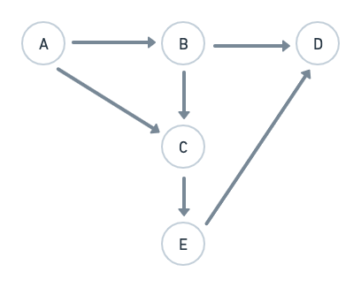

# hibernate-fsm

A layer on top of hIbernate which adheres configurable finite state machine. Prevents dirty commits which violates transitions.

When you have to apply some business logic can be converts to finite state machine, `hiberante-fsm` helps you achieve it.
It prevents invalid state transitions before saving it to the database so at application level you don't have to worry about.

---

## Prerequisites:
Finite State Machine [wiki](https://en.wikipedia.org/wiki/Finite-state_machine)

## Example


E.g.: For a `User` entity, there is a column `userState`.
- The possible values of `userState` are `"A", "B", "C", "D", "E"` (finite number of states)
- Initial state: `"A"`
- Valid transitions:
    1. A &rarr; B
    2. A &rarr; C
    3. B &rarr; C
    4. B &rarr; D
    5. C &rarr; E
    6. E &rarr; D
- Invalid transitions:
    1. A &rarr; D
    2. C &rarr; B
- This is how java code will look like for the said FSM.

```java
@Entity(name = "user")
public class User {

	private Long id;
	private String firstName;
	private String lastName;
	private int age;
	private String userHandle;

	/**
	 * `@StateMachine` conveys hibernate-fsm library, that `userState` is the column
	 * which should be checked every time there is a database transaction commit.
	 */
	@StateMachine(
			initialState = "A",
			/**
			 * This `config is generated based on the mentioned picture.
			 */
			config = {
					@Transition(fromState = "A", toState = {"B", "C"}),
					@Transition(fromState = "B", toState = {"C", "D"}),
					@Transition(fromState = "C", toState = {"E"}),
					@Transition(fromState = "E", toState = {"D"}),
			}
	)
	private UserState userState;
}
```


## How does it work?

While committing to the [database transaction](https://en.wikipedia.org/wiki/Database_transaction),
It runs behind the scenes of `save`, `saveAll` function executions, so you don't have to write anything here.
Following checks are done on `userState`, before committing to the database:

1. If a transition from `oldValue` &rarr; `newValue` is a valid transition from configuration
2. If it is a `insert` (new row in the table), it checks if the value is correct `initialState`.

If checks are passed then transaction is allowed to commit, otherwise the libary raises [`StateValidationException`](src/main/java/com/skydo/lib/fsm/exception/StateValidationException.java)

## More features

### 1. Validators:

Let's say, during the state transition of `A` &rarr; `B` you want to run some extra validations
on the db and allow transition depending on the status checks.

These validations can be anything like: querying other table `payment`, if the user had made the payment
then only allow user to move to state from `A` &rarr; `B`
To achieve this, create a `@Component` (must), wrap it with annotation
[`@TransitionValidatorHandler`](src/main/java/com/skydo/lib/fsm/definitions/validator/TransitionValidatorHandler.java), declare validation function inside this class and annotate this method with [`@TransitionValidator`](src/main/java/com/skydo/lib/fsm/definitions/validator/TransitionValidator.java)

**This validator is executed only after library has already confirmed that the transition is a valid transition.**

#### Example

```java
import com.skydo.lib.fsm.definitions.validator.TransitionValidator;
import com.skydo.lib.fsm.definitions.validator.TransitionValidatorHandler;
import com.skydo.lib.fsm.exception.StateValidationException;

@Component // <-- this is very important
@TransitionValidatorHandler(
    /**
     * entity's class reference
     */
    entity = User.class,
    /**
     * As java doesn't support annotation values at compile time,
     * we must pass field name in form of string, on which we have applied `@StateMachine` annotation.
     */
    field = "userState"
)
public class UserStateValidator {

	private static final Logger log = Logger.getLogger(UserStateValidator.class.getSimpleName());

	/**
	 * Assumption: transition is already a valid transition and post that this validator is executed.
	 *
	 * @param id `id` is user id. can be used to query other tables.
	 * @param oldState
	 * @param newState
	 */
	@TransitionValidator(
        /**
         * This function is executed only if the `newValue` is going to be `B`.
         */
        state = "B"
	)
	public void validateTransition(Long id, Object oldState, Object newState) {
		log.info("validateTransition called. id: " + id + " " + oldState + ", newState: " + newState);
		// Add more checks here.
		Payment payment = paymentRepository.findByUserId(id);
		if (payment.status != "PAID") {
			/**
			 * This exception will roll back the db transaction even though transition 
			 * `A` --> `B` was a valid one.
			 */
			throw StateValidationException(
                "Can't move user of id: " + id + " to state " + newState + " if payment status in unpaid."
			);
		}
	}
}
```


### 2. Post Commit Actions:

If you want to execute a side effect based function, which gets executed once a state "B" is reached.
The usage is very similar to the `validator`.

**This is executed outside of database transaction boundary.**

#### Example

```java
import com.skydo.lib.fsm.definitions.postupdate.PostUpdateAction;
import com.skydo.lib.fsm.definitions.postupdate.PostUpdateActionHandler;

@Component // <-- this is very important
@PostUpdateActionHandler(
    /**
     * entity's class reference
     */
    entity = User.class,
    /**
     * As java doesn't support annotation values at compile time,
     * we must pass field name in form of string, on which we have applied `@StateMachine` annotation.
     */
    field = "userState"
)
public class UserStatePostCommitActions {

	private static final Logger log = Logger.getLogger(UserStateValidator.class.getSimpleName());

	/**
	 * Assumption: transition is already a valid transition and post that this validator is executed.
	 *
	 * @param id `id` is user id. can be used to query other tables.
	 * @param oldState
	 * @param newState
	 */
	@PostUpdateAction(
        /**
         * This function is executed only if the `newValue` is going to be `B`.
         */
        state = "B"
	)
	public void postUpdateActionOnStateB(Long id, Object oldState, Object newState) {
		log.info("postUpdateActionOnStateB called. id: " + id + " " + oldState + ", newState: " + newState);
		// Add any side effect functions here
        // e.g. Send Email / Notification
	}
}
```

